# Semaine 2 - If/Else, Opérateurs, Switch
```bash
cd semaine2
```
## Étape 1 : If/Else - Prendre des Décisions
### Exercice 1 : Affiche un message si la température > 30 - If simple
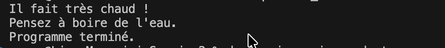
```bash
dart premier_if.dart
```
### Exercice 2 : Vérifie l'âge et indique majeur ou mineur - If/Else
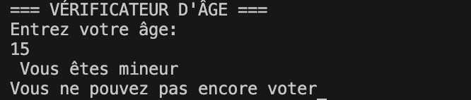
```bash
dart majeur_mineur.dart
```
### Exercice 3 : Calculateur de Mention. Donne une mention selon la note sur 20 - If/Else If/Else
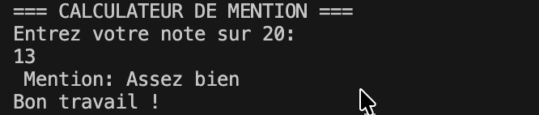
```bash
dart mentions.dart
```
### Exercice 4 : Système de Connexion. Vérifie identifiant et mot de passe - Conditions imbriquées
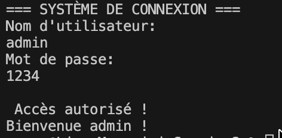
```bash
dart connexion.dart
```
### Exercice 5 : Prix avec Réduction. Applique une réduction si le prix > 100€ - Opérateur ternaire
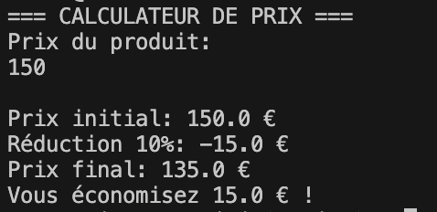
```bash
dart reduction.dart
```
### Exercice Bonus 6: Calculateur IMC Amélioré. Calcule l'IMC et affiche l'interprétation.
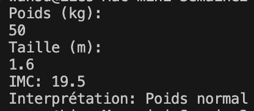
```bash
dart exercice_bonus_calculateur_imc.dart
```
## Étape 2 :  Opérateurs de Comparaison et Logiques
### Exercice 1 : Tester Tous les. Montre les opérateurs de comparaison de base.
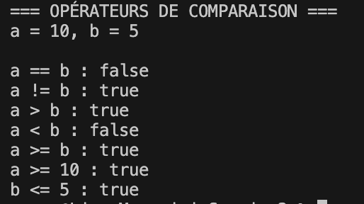
```bash
dart operateurs_comparaison.dart
```
### Exercice 2 :  Opérateur ET. Exige deux conditions vraies pour autoriser l'accès.
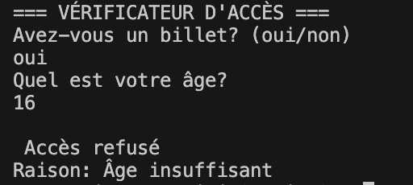
```bash
dart operateur_et.dart
```
### Exercice 3 :  Opérateur OU. Autorise si au moins une condition est vraie.
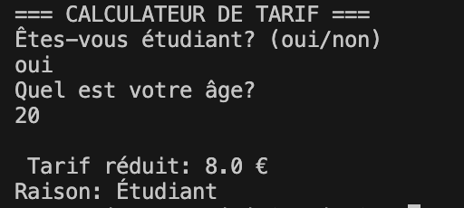
```bash
dart operateur_ou.dart
```
### Exercice 4 :  Opérateur NON. Utilise la négation pour contrôler l'accès.

```bash
dart operateur_non.dart
```
### Exercice 5 : Conditions Complexes. Combine conditions pour décider la livraison.
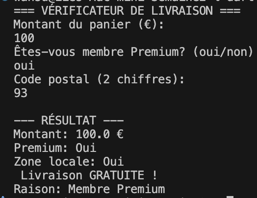
```bash
dart conditions_complexes.dart
```
### Exercice 6 : Recherche de Produit. Cherche un produit dans une liste.
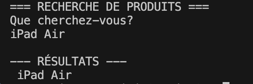
```bash
dart recherche.dart
```
### Exercice Bonus 7 : Validateur de Mot de Passe. Valide un mot de passe selon des règles simples.
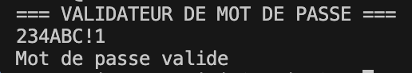
```bash
dart exercice_bonus_validateur.dart
```
## Étape 3 : Switch - Choix Multiples
### Exercice 1 : Affiche un menu et exécute le choix - Switch Simple
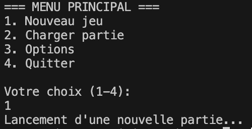
```bash
dart premier_switch.dart
```
### Exercice 2 : Convertisseur de Mois. Affiche nom, jours et saison selon le numéro
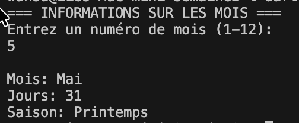
```bash
dart mois.dart
```
### Exercice 3 : Calculatrice. Effectue +, -, ×, / selon l'opération - Cases Multiples
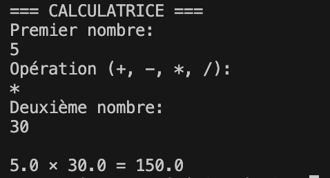
```bash
dart calculatrice_switch.dart
```

## Étape 4 : Défi - Système de Notes Interactif
### Exercice Complet : Saisie de notes, calcul de la moyenne et génération d'un bulletin.
Utilise :
- Variables : nom, notes, moyenne.
- Fonctions : main, parse (stdin).
- If / else if / else : mentions.
- Opérateurs : >=, &&, !.
- Switch : conseils.
- Opérateur ternaire : estAdmis ?.
- Interpolation de chaînes : $moyenne.

TOUS les concepts de la Semaine 2.

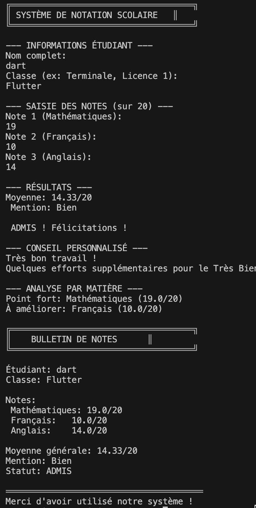

```bash
dart systeme_notes.dart
```

## Exercices Supplémentaires 
### Niveau 1 : Débutant
1. Système de Réduction
   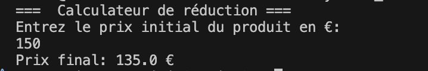
   ```bash
   dart systeme_reduction_niveau1.dart
   ```
2. Vérificateur de Mot de Passe
   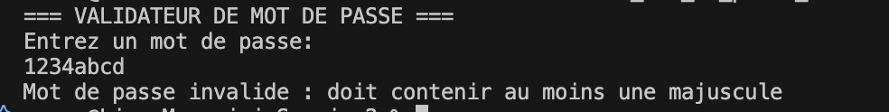
   ```bash
   dart verificateur_mot_de_passe_niveau1.dart
   ```
3. Convertisseur de Notes
   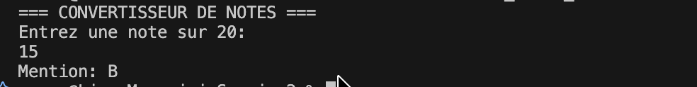
   ```bash
   dart convertisseur_notes_niveau1.dart
   ```
### Niveau 2 : Intermédiaire
1. Calculateur d'Impôts
   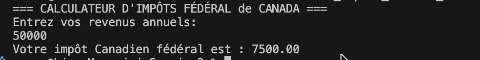
   ```bash
   dart calculateur_impots_federal_niveau2.dart
   ```
2. Système de Réservation
   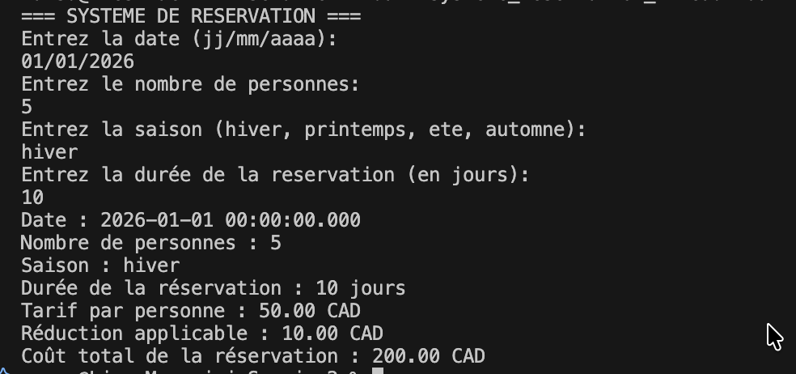
   ```bash
   dart systeme_reservation_niveau2.dart
   ```
3. Jeu Pierre-Papier-Ciseaux
   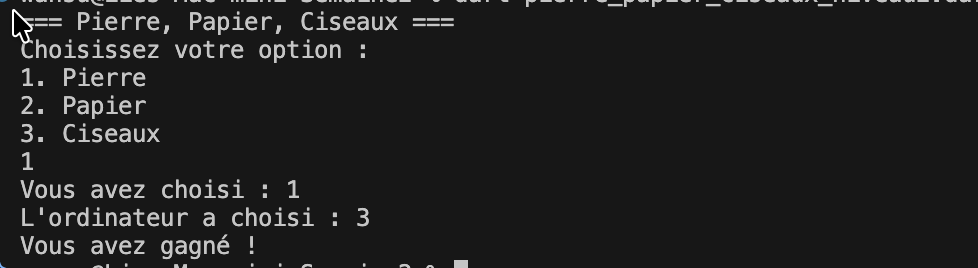
    ```bash
    dart pierre_papier_ciseaux_niveau2.dart
    ```
### Niveau 3 : Avancé
1. Gestionnaire de Panier E-Commerce
   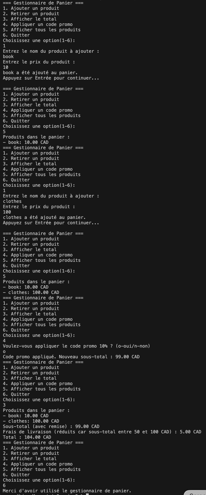
   ```bash
   dart gestionnaire_panier_niveau3.dart
   ```
2. Analyseur de Texte 
   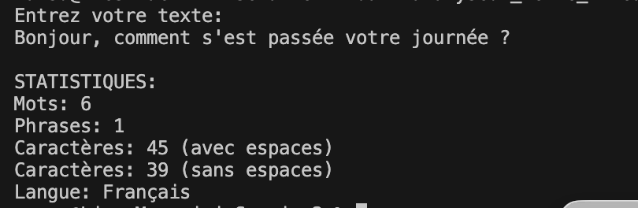
   ```bash
   dart analyseur_texte_niveau3.dart
   ```
3. Mini-RPG
   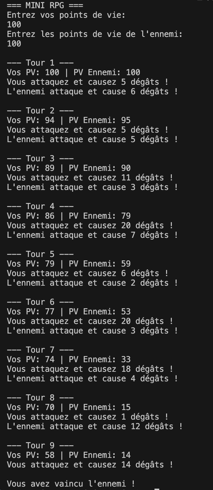
   ```bash
   dart mini_rpg_niveau3.dart
   ```


# Récapitulatif Complet
## If/Else
```bash
if (condition) {
 // Si vrai
} else if (autreCondition) {
 // Si autre vrai
} else {
 // Si toutes fausses
}
```
## Opérateurs de Comparaison
```bash
==  // Égal
!=  // Différent
>   // Plus grand
<   // Plus petit
>=  // Plus grand ou égal
<=  // Plus petit ou égal
```
## Opérateurs Logiques
```bash
&&  // ET (les deux vrais)
||  // OU (au moins un vrai)
!   // NON (inverse)
```
## Switch
```bash
switch (variable) {
 case valeur1:
  // Code
  break;
 case valeur2:
  // Code
  break;
 default:
  // Par défaut
}
```
