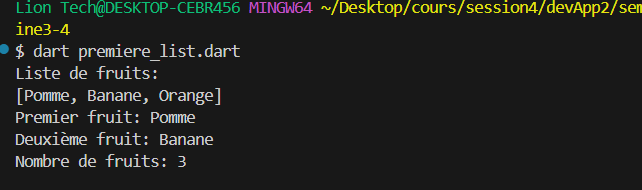
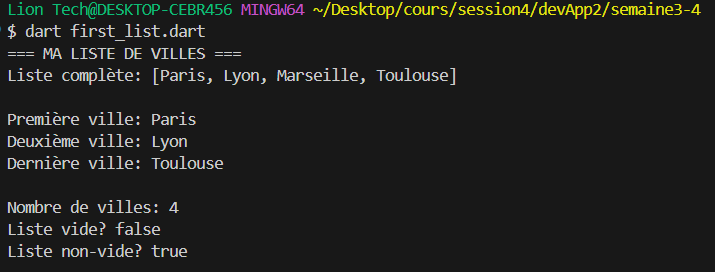
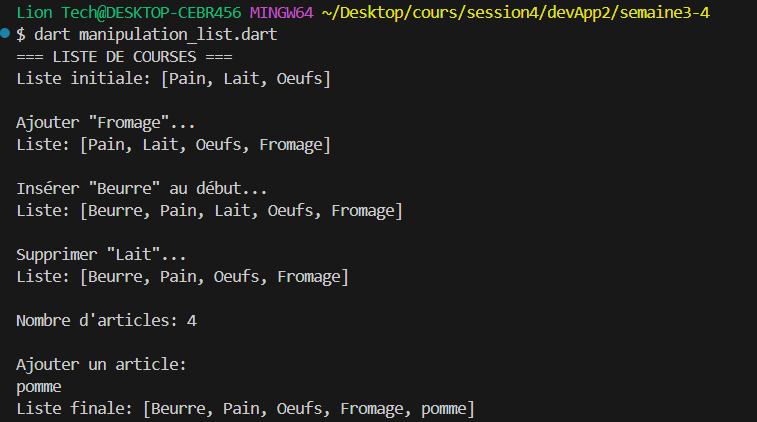
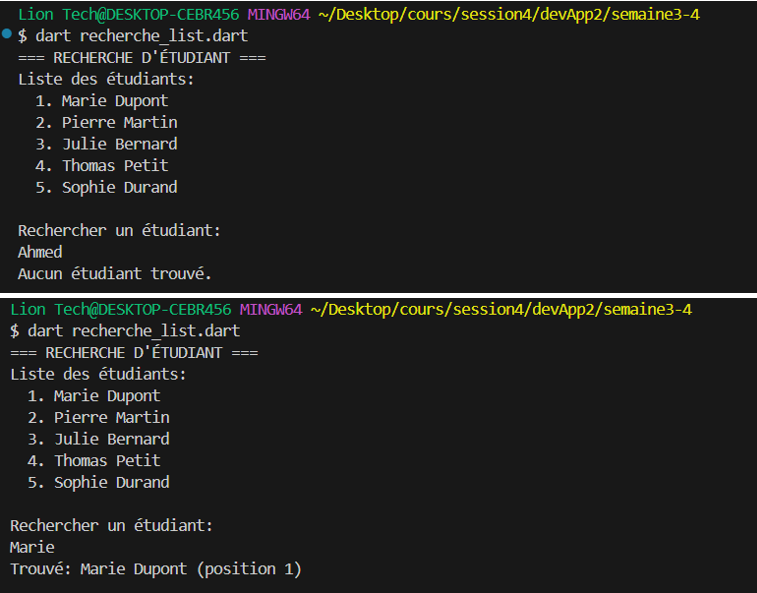
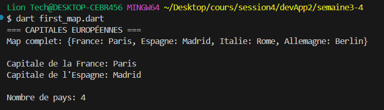
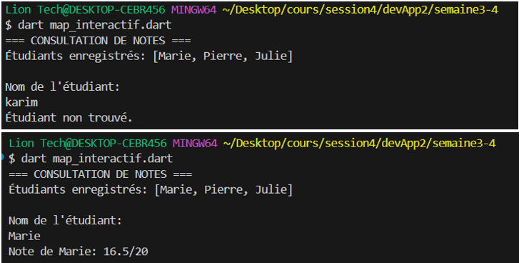
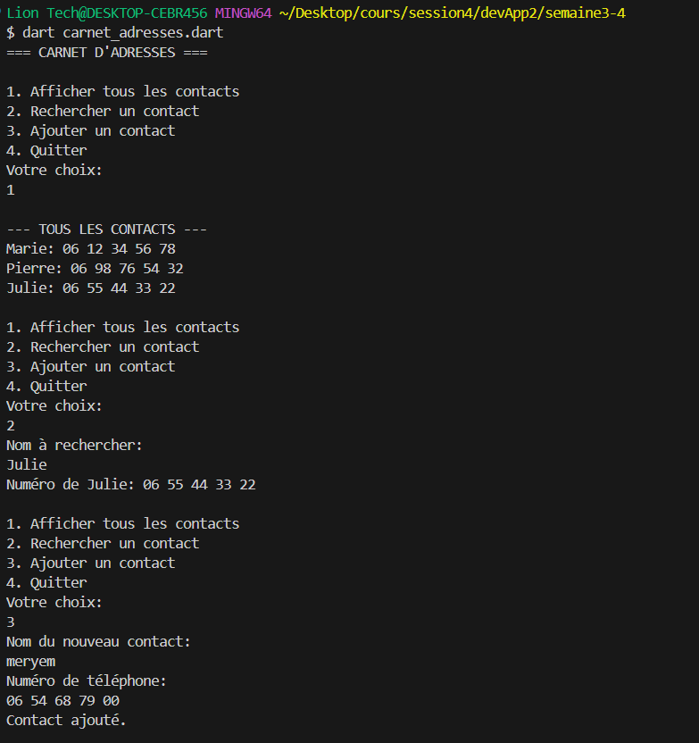
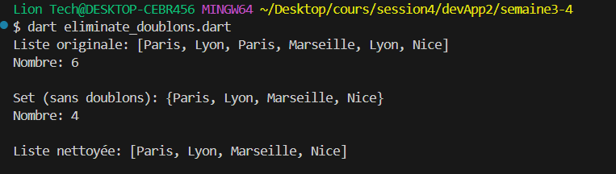
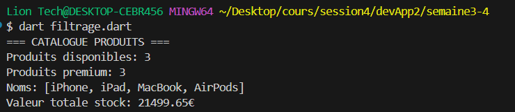
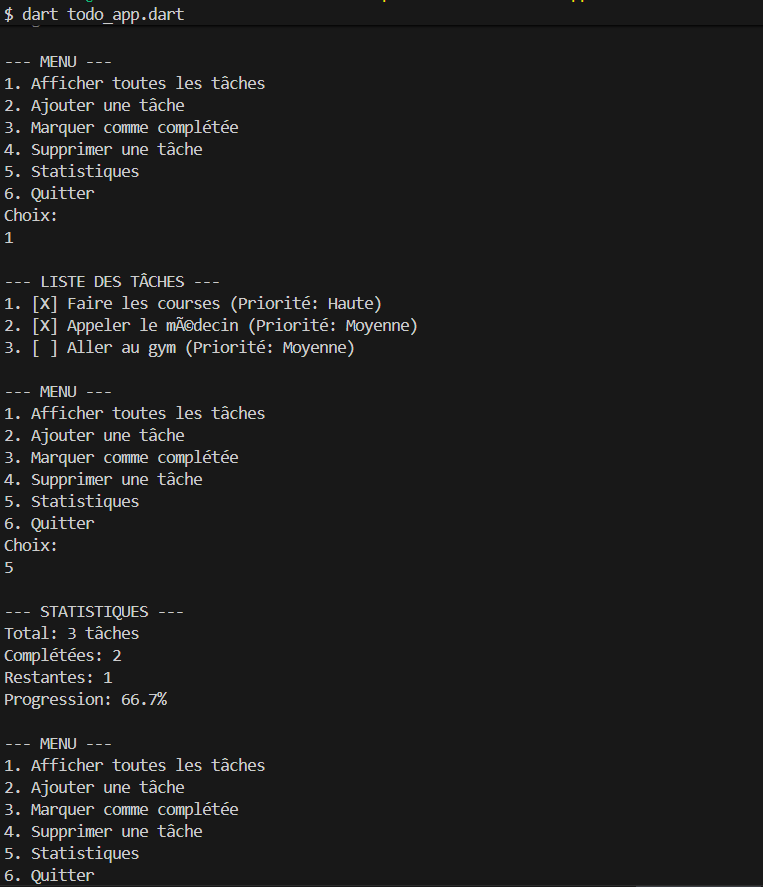

# Semaine 3 - Collections de Données

## Étape 0 : Rappel et Préparation

### Exercice 1 : Premier Exemple de List
```bash
dart premier_list.dart
```

## Étape 1 : Lists - Listes Ordonnées

### EXERCICE 1 : Première List
```bash
dart first_list.dart
```

### EXERCICE 2 : Manipulation de List
```bash
dart manipulation_list.dart
```

### EXERCICE 3 : Recherche dans une List
```bash
dart recherche_list.dart
```

## Étape 2 : Maps - Paires Clé-Valeur

### EXERCICE 1 : Premier Map
```bash
dart first_map.dart
```

### EXERCICE 2 : Map Interactif
```bash
dart map_interactif.dart
```

### EXERCICE 3 : Carnet d'Adresses

```bash
dart carnet_adresses.dart
```

## Étape 3 : Sets et Méthodes Avancées

### EXERCICE 1 : Éliminer les Doublons
```bash
dart eliminate_doublons.dart
```

### EXERCICE 2 : Filtrage de Données
```bash
dart filtrage.dart
```

## Étape 4 : Défi - Gestionnaire de Tâches

### PARTIE 1 : Structure de Base
```bash
dart todo_app.dart
```
