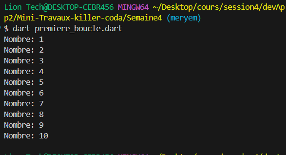
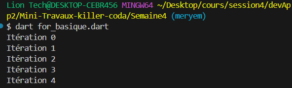
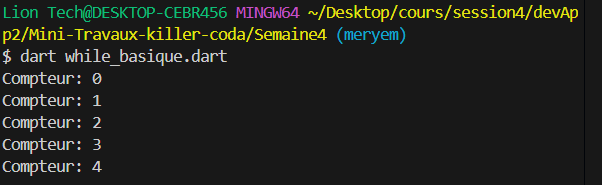
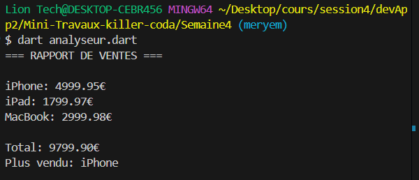

# Semaine 4 - Boucles et Itérations


## Étape 0 : Rappel et Préparation

### Exercice 1 : Premier Exemple de Boucle
```bash
dart premiere_boucle.dart
```

## Étape 1 : Boucle For
### Exercice 1 : Premier Exemple de Boucle
```bash
dart for_basique.dart
```


## Étape 2 : Boucle While
### Exemple1:
```bash
dart while_basique.dart
```

## Étape 3 : Itération sur Collections


## Étape 4 : Défi - Analyseur de Données
### Projet : Analyseur de Ventes
```bash
dart analyseur.dart
```
