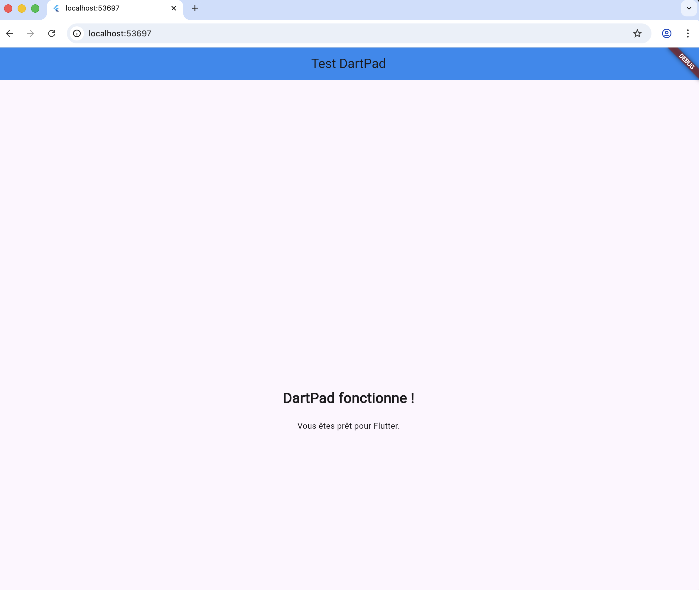
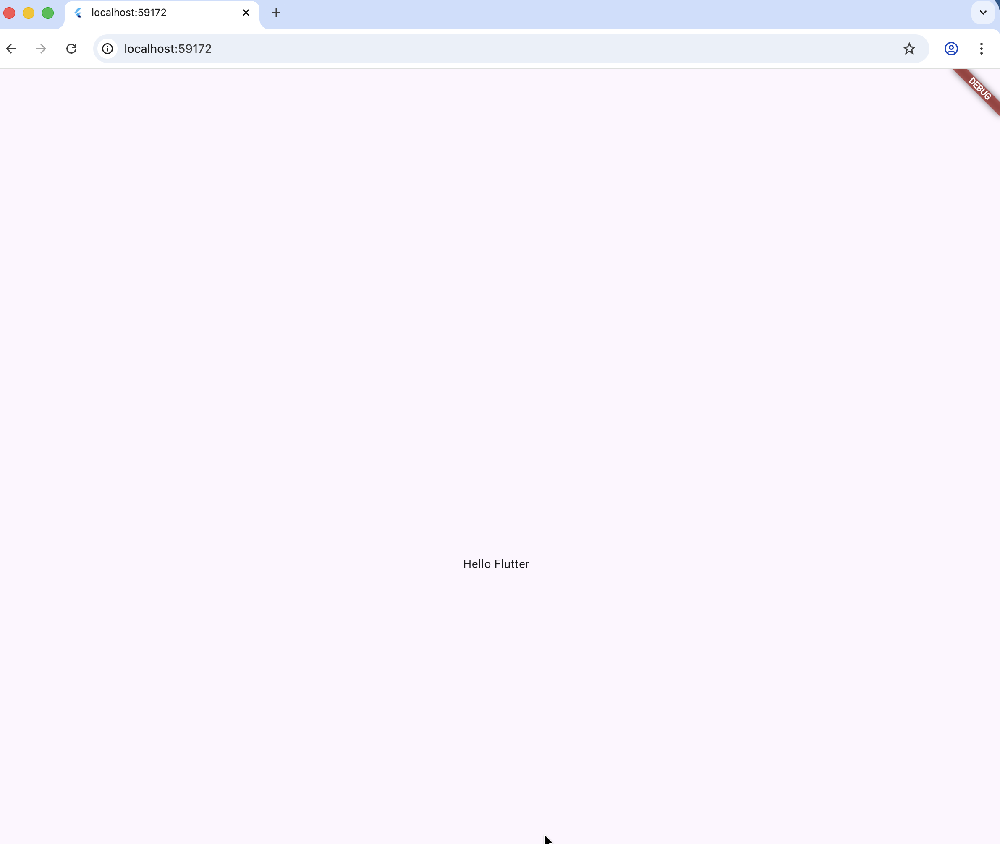
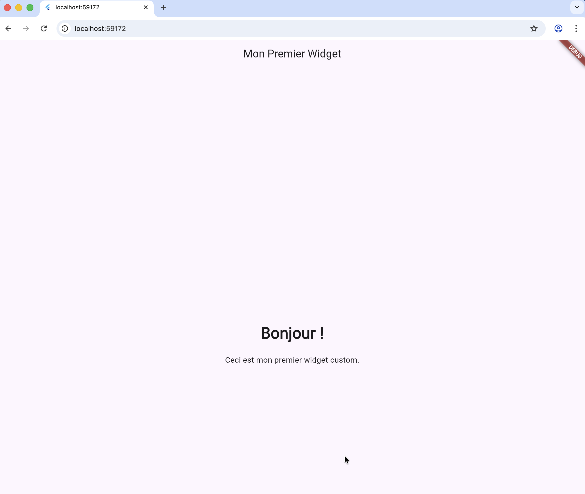
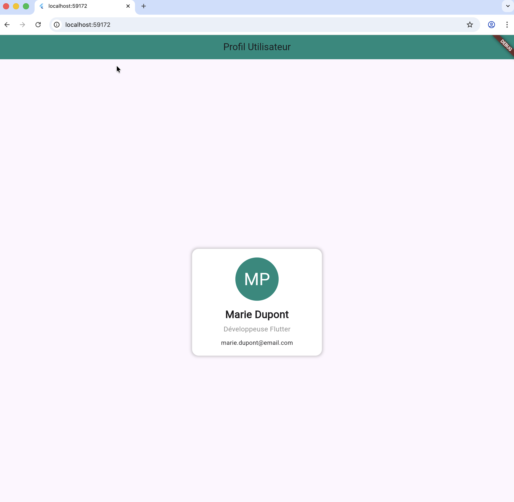
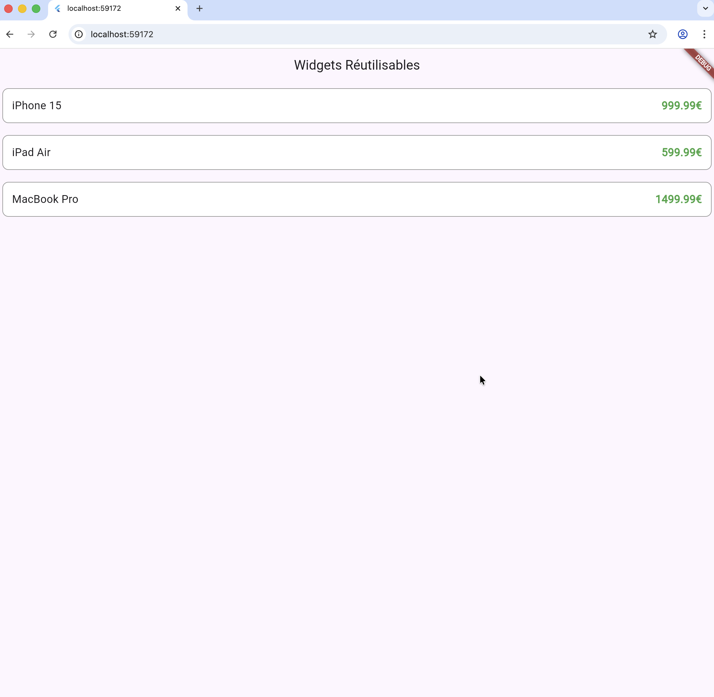
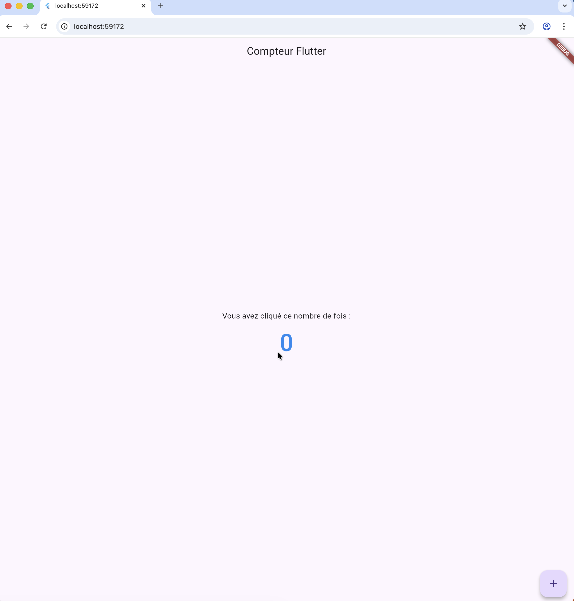
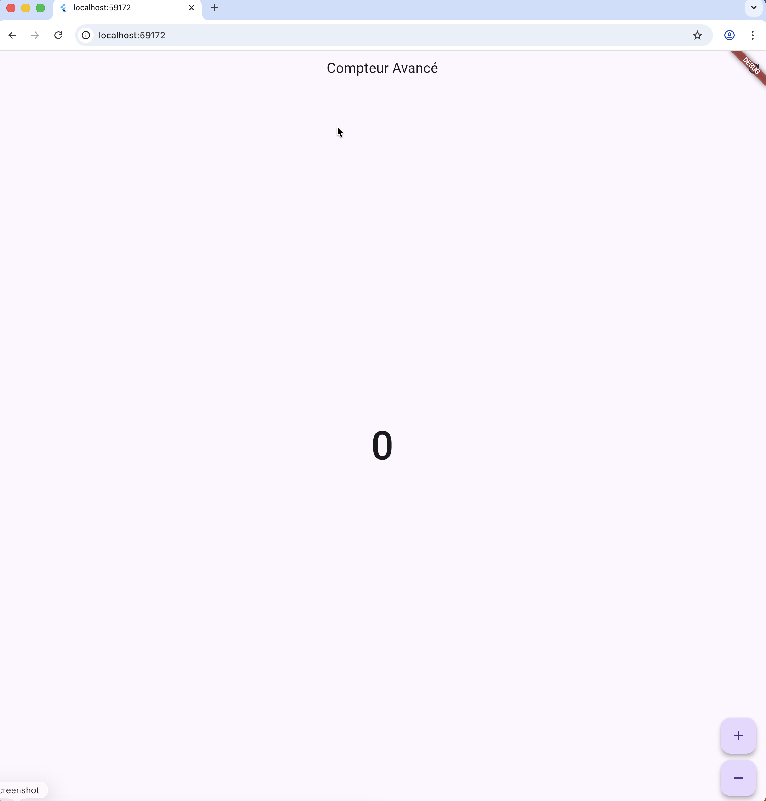
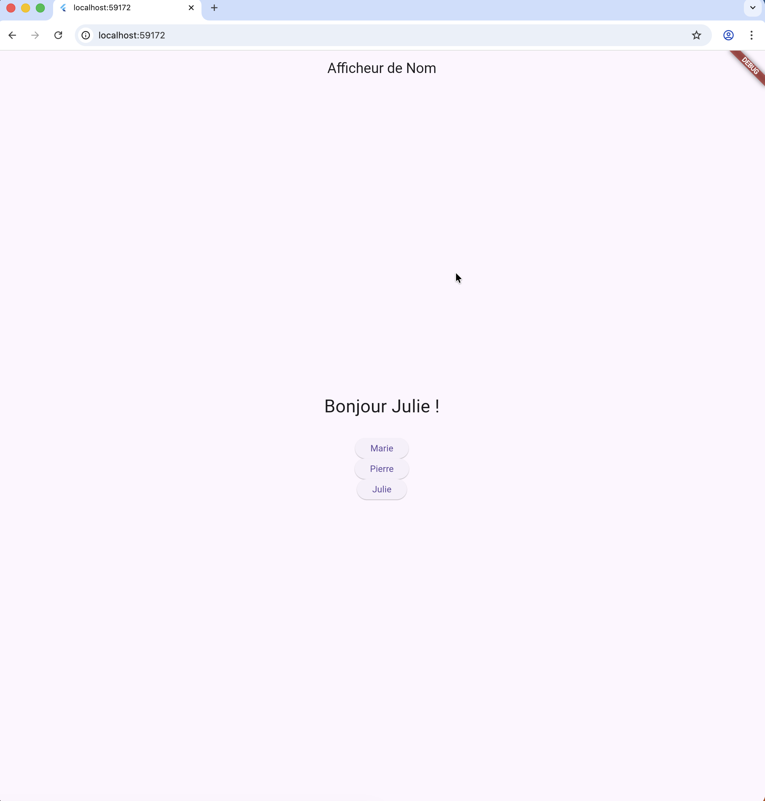
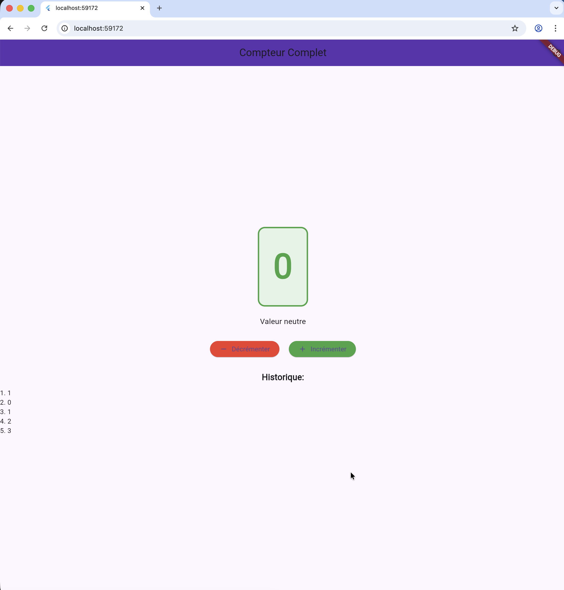

# Semaine 7 : Flutter Introduction
```bash
cd Semaine7
```
Pour tester un exercice, copier le fichier voulu en tant que lib/main.dart puis lancer l'app :

mac / Linux (Terminal)
```bash
cp path/to/mainX.dart lib/main.dart
flutter run
```

Windows (CMD)
```cmd
copy ..\path\to\mainX.dart lib\main.dart
flutter run
```

Windows (PowerShell)
```powershell
Copy-Item '..\path\to\mainX.dart' -Destination 'lib\main.dart'
flutter run
```

Remarques :
- Remplacez mainX.dart par main1.dart, main2.dart, ..., main9.dart.

## Étape 1 : Installation et Configuration de Flutter
## Exercice 1 — Premier Test (main1.dart)
Vérifier que Flutter démarre correctement en affichant un message simple.


## Exercice 2 — Code Minimum (main2.dart)
Créer l'application Flutter la plus petite qui affiche "Hello Flutter".


## Étape 2 : Premier Widget - StatelessWidget
## Exercice 3 — Premier Widget (main3.dart)
Construire un StatelessWidget personnalisé qui affiche un texte de bienvenue.


## Exercice 4 — Carte de Profil (main4.dart)
Réaliser une carte de profil utilisateur avec avatar, nom et rôle.


## Exercice 5 — Widget Réutilisable (main5.dart)
Créer un widget réutilisable pour afficher des cartes produit simples.


## Étape 3 : StatefulWidget et State
## Exercice 6 — Compteur Simple (main6.dart)
Implémenter un StatefulWidget avec un compteur qui s'incrémente.


## Exercice 7 — Boutons Multiple Actions (main7.dart)
Ajouter plusieurs actions (incrémenter, décrémenter, réinitialiser) au compteur.


## Exercice 8 — Afficheur de Nom (main8.dart)
Changer et afficher dynamiquement un nom via des boutons.


## Étape 4 : Projet - Application Compteur
## Exercice 9 — Application Compteur Complète (main9.dart)
Assembler une application complète avec compteur, historique et affichages conditionnels.
