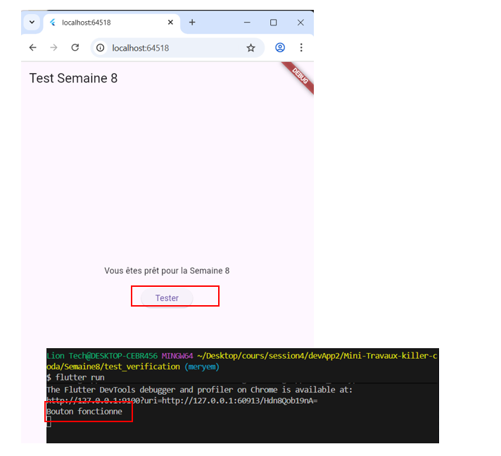
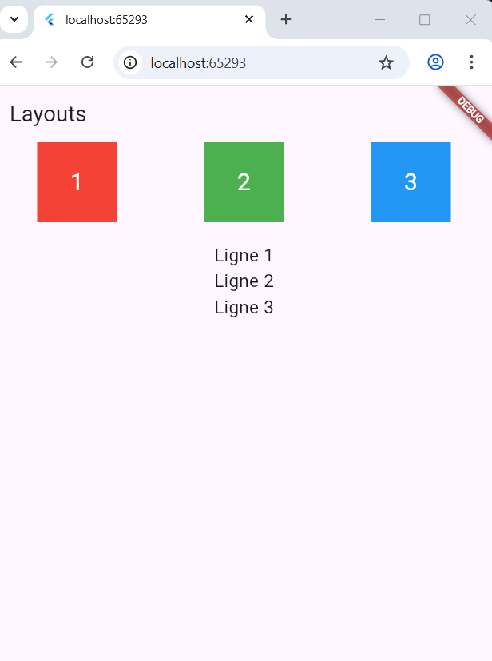
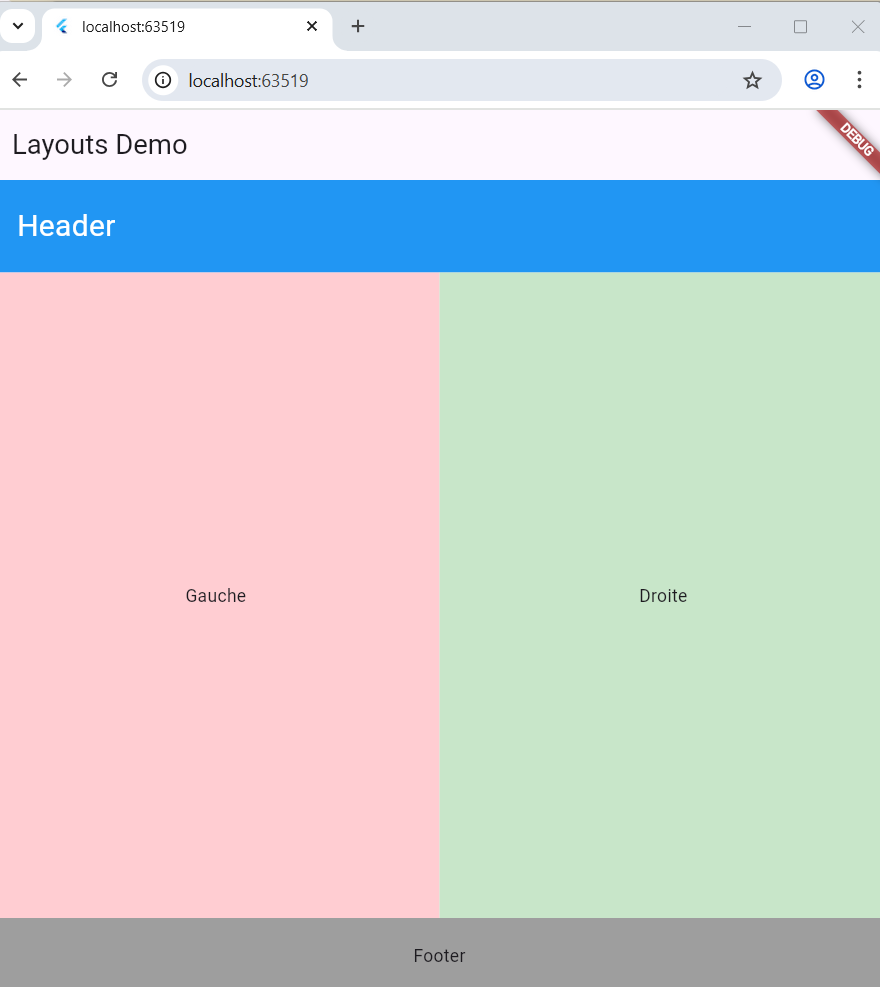
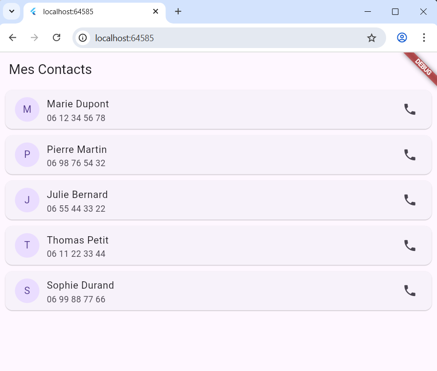

# Flutter Semaine 8 - UI et Layouts

## Étape 0 : Widgets de rappel
```bash
flutter run
```


### Premier Exemple : Colonne et Ligne


## Étape 1 : Agencements – Colonne, Ligne, Pile
### Exercice : Page avec mises en page


## Étape 2 : ListView et ScrollView



## Étape 3 : Style et thématique
## Étape 4 : Projet - Page de Profil Complet
